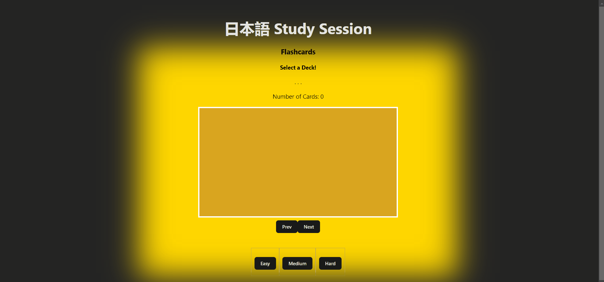

# Web Development Project 2 - *Project2*

Submitted by: **Aaron Mills**

This web app: **This is a simulation of a flashcard system which can be used for studying Japanese.**

Time spent: **10.4** hours spent in total

## Required Features

The following **required** functionality is completed:

- [X] **The title of the card set and some information about it, such as a short description and the total number of cards are displayed**
- [X] **A single card at a time is displayed, only showing one of the components of the information pair**
- [X] **A list of card pairs is created**
- [X] **Clicking on the card shows the corresponding component of the information pair**
- [X] **Clicking the next button displays a random new card**

The following **optional** features are implemented:

- [X] Cards contains images in addition to or in place of text
- [X] Cards have different visual styles such as color based on their category
  - [X] *visual style implemented*

The following **additional** features are implemented:

* [X] List anything else that you added to improve the site's functionality!
    - [X] Clicking the prev button displays the last card (within the same deck) that the user has viewed
## Video Walkthrough

Here's a walkthrough of implemented required features:
<!-- Imagur: https://imgur.com/a/u36IdGX  -->

<!-- Replace this with whatever GIF tool you used! -->
GIF created with ScreenToGif  
<!-- Recommended tools:
[Kap](https://getkap.co/) for macOS
[ScreenToGif](https://www.screentogif.com/) for Windows
[peek](https://github.com/phw/peek) for Linux. -->

## Notes

Describe any challenges encountered while building the app.
- Anything related to styling an image is a nuissence
- Writing code before having a plan of the structures I'd need turned out to create inconviniences later, as I've had to update function calls / references later. An example includes assuming a deck of 
cards would just be a list, instead of a structure that holds card name & description.

## License

    Copyright [yyyy] [name of copyright owner]

    Licensed under the Apache License, Version 2.0 (the "License");
    you may not use this file except in compliance with the License.
    You may obtain a copy of the License at

        http://www.apache.org/licenses/LICENSE-2.0

    Unless required by applicable law or agreed to in writing, software
    distributed under the License is distributed on an "AS IS" BASIS,
    WITHOUT WARRANTIES OR CONDITIONS OF ANY KIND, either express or implied.
    See the License for the specific language governing permissions and
    limitations under the License.